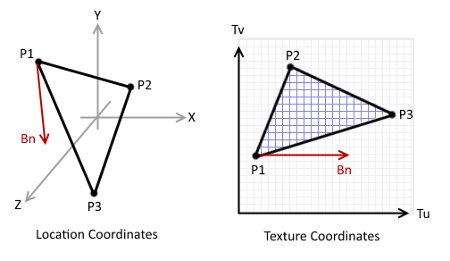

# Shapes

Shapes describe the geometry of an entity being rendered.

The shape is defined as a set of vertices and renderable elements.
The vertices are the location and additional rendering information such as
the texture coordinates, normals, binormals, etc.. The renderable elements
are points, lines, and faces. The point indicates that a vertex should be
drawn. The line joins two vertices to draw a line. The face joins three
points into a filled triangle. The face contains additional information
such as the normals and binormals of a face. The order of the vertices
also defines the winding, clockwise or counter-clockwise, of a face.

### Calculating Face Binormals



Given:
```
P1 = <x1, y1, z1, u1, v1>
P2 = <x2, y2, z2, u2, v2>
P3 = <x3, y3, z3, u3, v3>
```

Try to solve for:

```
P4 = <x4, y4, z4, u4, v4>
```

Solving using the two-line intersection equation,
Where the first line, `A`, is `<u2, v2, u3, v3>`,
And the second line, `B`, is `<u1, v1, u1+1, v1>`:

```
dAu = u3 - u2
dAv = v3 - v2
dBu = u1+1 - u1 = 1
dBv = v1 - v1 = 0
det = (dAu * dBv) - (dAv * dBu)
    = 0*(u3 - u2) - 1*(v3 - v2)
    = v2 - v3
```

if `det` is equal to zero then
`Bn = |P3 - P2|` if `dAu > 0` or
`Bn = |P2 - P3|` if `dAu < 0`
else

```
dABu = u2 - u1`
dABv = v2 - v1`
num = (dABv * dBu) - (dABu * dBv)`
    = 1*(v2 - v1) - 0*(u2 - u1)`
    = v2 - v1`
r = num / det`
  = (v2 - v1) / (v2 - v3)
```

Use the Bezier linear factor, `r`, to calculate all values of `P4`:

```
P4' = P2 + r*(P3-P2)
```

The point of intersection may have been behind the initial point,
therefore if `u4 - u1 < 0` then use `Bn = |P3 - P4|`
else `Bn = |P4 - P3|`.
